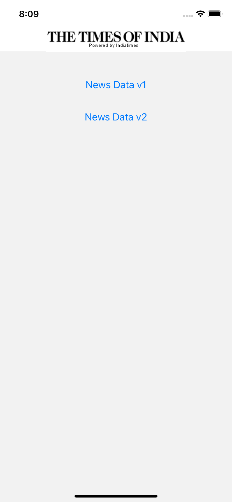
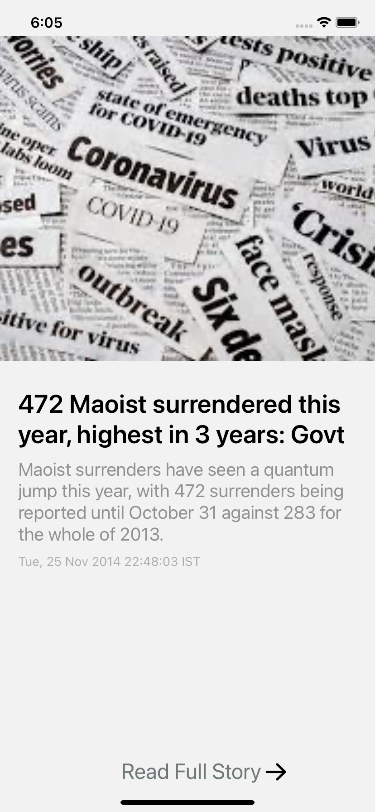
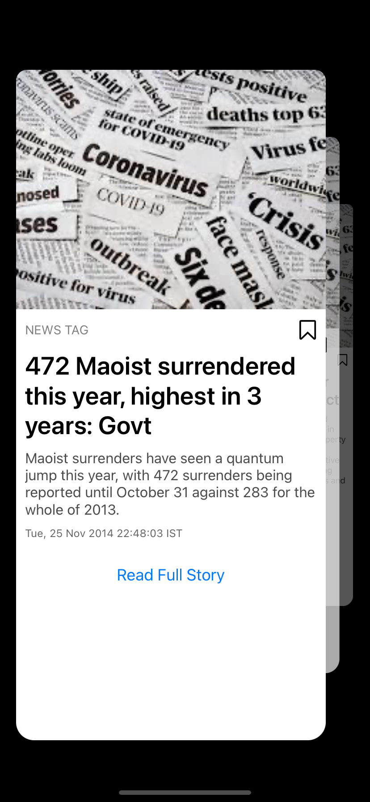

# React native Assignment for MOXIE

## Key Points
1. API ENDPOINT: [https://timesofindia.indiatimes.com/rssfeeds/1221656.cms](https://timesofindia.indiatimes.com/rssfeeds/1221656.cms)

2. Display Each News Content on Screen 

3. Fetch data in every 'n' minutes (2 min in this case)

## Challenges:

1. Response Data is in XML format

2. No Specific UI to display data

3. News items with no valid image have dummy image hosted at [https://generalimagestest.s3.us-east-2.amazonaws.com/template.jpeg](https://generalimagestest.s3.us-east-2.amazonaws.com/template.jpeg)

## Demo
1. Version 1 with simple Flat list

2. Version 2 Advanced Flat List Animation

## Result

1. Created 3 Major Screen
    - Navigation Screen
    - V1 Screen
    - V2 Screen

2. Navigation Screen

3. V1 Screen

4. V2 Screen

### To Do:

V2:-

1. Fix deep link
2. Fix Bookmark button
3. SImple animation fixes
4. Implement React  Native Shared element transistion